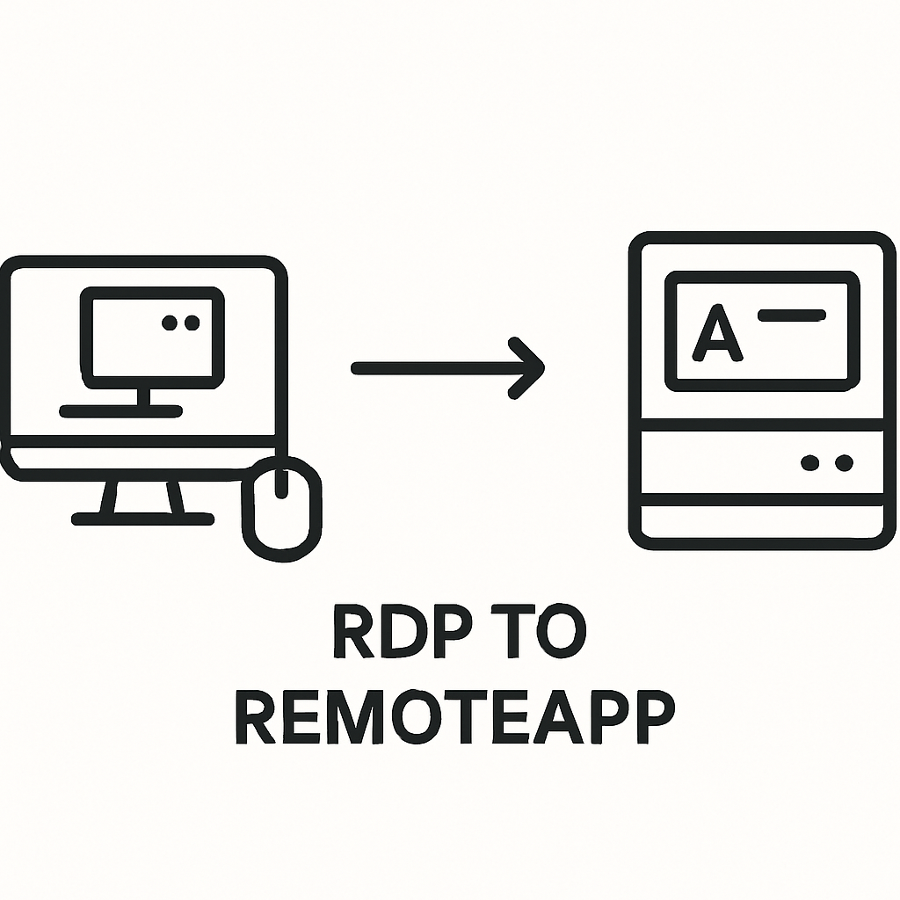
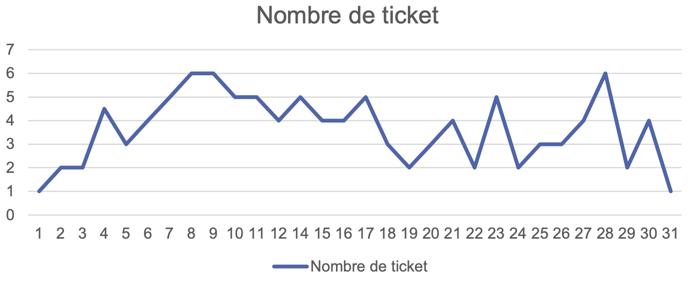

# 🚀 Migration RDS vers RemoteApp

Projet réalisé au sein de l'entreprise **Agoravita** pour le compte du client *******, réseau de plus de 170 agences d'intérim.

## 🎯 Objectif

Optimiser l'accès aux applications métiers critiques via **RemoteApp** pour :

- Réduire la latence et les ralentissements lors des jours de paie
- Diminuer le nombre de tickets de support liés aux sessions RDS
- Améliorer l'expérience utilisateur et la productivité

---

## 🏗️ Architecture avant / après

### Avant :
- Chaque agence connectée via VPN IPSEC à un serveur RDS dédié dans un datacenter.
- Surcharge des serveurs les jours de forte activité.

### Après :
- Utilisation de **RemoteApp** pour publier uniquement les applications essentielles.
- Réduction de la bande passante utilisée.
- Amélioration de la réactivité des applications.

---

## 🛠️ Étapes de mise en œuvre

1. **Étude de l'existant et des alternatives**
2. **Déploiement de RemoteApp**
3. **Configuration des collections d'applications**
4. **Attribution des droits via groupes de sécurité AD**
5. **Déploiement des raccourcis et mappages réseau via GPO**
6. **Redirection des imprimantes et sécurisation des dossiers utilisateurs**

---

## 🧪 Tests & validation

- Vérification de l'apparition des raccourcis RemoteApp
- Tests de performance (latence et charge CPU)
- Installation VPN pour les ordinateurs portables
- Contrôle d’accès sécurisé aux applications et partages réseau

---

## 📈 Résultats observés

| Jour du mois | CPU RDS (%) | Latence (ms) |
|--------------|-------------|--------------|
| Avant        | 90-100%     | 80-120       |
| Après        | 40-60%      | 40-80        |

- 🎉 Baisse de +50% de la charge CPU
- 📉 Diminution significative des tickets de support

- 👍 Expérience utilisateur largement améliorée

---

## 📎 Sécurité

- Attribution granulaire des droits (ex : `GpUser-RemoteApp_Banco`)
- Sécurisation des partages réseau et dossiers personnels
- Redirection imprimantes activée selon agence

---

## 📝 Conclusion

La migration vers RemoteApp a permis de moderniser l'infrastructure d’accès distant de Temporis, tout en améliorant la productivité et la stabilité du SI. Ce projet a également servi de base pour d’autres agences du groupe.
